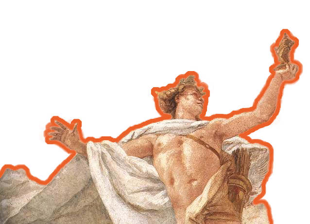

title: About
slug: about

<aside class="post-author" style="margin-left: 0px;margin-right: 0px;border-top: none;border-bottom: 1px solid #e5e4e1;">
        <figure class="post-author-avatar">
            
        </figure>
    

        <h4 class="post-author-name"><a href="https://leonis.cc/author/leo.html">Leo</a></h4>
        
A biochemist who doesn't know about classical literature isn't a good programmer. Cool, huh?

        <i class="ic ic-location"></i> Tientsin
        <a rel="noopener" target="_blank" href="https://leonis.cc"><i class="ic ic-link"></i> Website</a>
        <a rel="noopener" target="_blank" href="https://github.com/Tseing"><i class="ic ic-github"></i> GitHub</a>
        <a rel="noopener" target="_blank" href="mailto:im.yczeng@outlook.com"><i class="ic ic-mail"></i>  im.yczeng@outlook.com</a>
    

    

</aside>

👋 你好，朋友！欢迎来到我的博客！

这是一个使用 Pelican 生成的静态博客，部署在美国的一台服务器上，如果对博客的设置或结构感兴趣，你可以在网页的左下角找到这个博客的源码。

网站封面来自于美国印象派画家 Walter Launt Palmer 的画作 [*Lake at Appledale*](https://www.artic.edu/artworks/180648/lake-at-appledale)，页面上方的图片是日本像素画家[豊井祐太](http://1041uuu.tumblr.com/)的作品，恰当地符合我盼望夏天的心情 ⛅

## 🌈 Who am I

    

        
        
你可以称呼我为 Leo，这个博客的域名 <code>leonis.cc</code> 也是来源于其所有格 <a href="https://www.collinsdictionary.com/dictionary/english/leonis" rel="noopener" target="_blank"><em>Leonis</em></a>，还兼有着「♌ 狮子座」的意思，暗合我的生日。

        
        
我出生于福建，母语是<a href="https://www.ethnologue.com/language/cdo/" rel="noopener" target="_blank">闽东语</a>，在 <a href="https://www.iso.org/iso-639-language-codes.html" rel="noopener" target="_blank">ISO 639-3</a> 中分到的语言代码是 <code>cdo</code>，我目前的坐标是天津。

        
        
📚️ 喜欢读古籍，正在文献学和小学的海洋中遨游，平时读书多是文学和历史类。金石和书法也是我的兴趣，在捉刀和捉笔上消磨了许多光阴。

    

    

        
        
📬 我还喜欢收集各地的邮戳，也欢迎通过书信的方式联系我。我们不仅可以在互联网上互相成为读者，还可以成为线下的笔友，无论身处何地，都欢迎来信。

        
        
🏔️ 闲时总喜欢到处走走，所谓「江山留胜迹，我辈复登临」，见识各地的山川风土、发现近被人遗忘的故事总能使我快慰，往下翻翻可以找到我的足迹地图。

    

爱好和兴趣谈论了很多，但以上种种都与我的主业不相干，我从事的领域是 ⚗️ 计算化学、化学信息学、药物化学等等，所以不可避免地也了解 💻 数据科学、人工智能等等交叉领域的工具和技能，目前正在学习

- <i class="fa fa-pencil-square-o"></i> 自然语言处理
- <i class="fa fa-pencil-square-o"></i> C++
- <i class="fa fa-pencil-square-o"></i> PostgreSQL

## 💡 Origin

建立这个博客的源起，正如鄙站的副标题所言：

> *A nook to hoard my manuscripts.*

仅仅是为了堆放我那无处安放的胡思乱想罢了。

可能所有经营博客的人都有这样一个过程，在一开始总是在各种美化上废尽了心力，文章的产出反而没有多少。我也在经过一阵反复安慰自己「必先利其器」的折腾后，终于敲定了一套稍合眼缘的主题，也终于把精力腾挪到写作上来了。

回想「写作」一词，印象中笔耕最勤的阶段可能就是高中了，但那不过是应试之作。在疏离纸笔的今天，文字于我为何呢？

在古人的故事中，仓颉造字而「天雨粟、鬼夜哭」，到了后世既而有「敬惜字纸」的传统，这大概都是因为古时常人难觅文字书籍。揆诸当下，身处文字信息的汪洋之中，坐地便可阅无数典籍，反而不知多久没有一笔一划写出所思所想了。这样比来，我不知道离文字更远究竟是古人还是今人了。在痛定思痛之下，我想着还是应该捉起笔练一练写作，由是诞生了几篇稍堪阅的文章，后来观文字过于幼稚，所以将其雪藏了。

再后来我也用我的博客来堆放我的学习笔记，因为总有一些刹那间的「顿悟」挥手即忘，几日后就再看不懂了，所以还是记录下来为妙，这些「顿悟」也称得上是胡思乱想吧。在写了一些文章后，我也习惯了用 Markdown 写作，回头发现多写笔记实在大有裨益，一则遣词造句学问颇大，二则用词达义颇难，不知不觉间也是在锻练写作。同时，能将自己的知识分享出去又实是一件乐事，我想这也是坚持写下去的原因之一吧。

写出好文章并不是件容易的事，有大量的输入才能汇而为一点的输出，我自认为让我来写专业的文章是力有不逮的，甚至惶恐于留下的错误会误导读者，所以我的文章如蒙见阅，还请不吝指出其中的错误。读者倘若是从我的稗稿之中获得了想要的内容、解决了问题，甚至做出了成绩，也不妨告诉我，我也实在与有荣焉 🥰

## 🔖 Categories

我的博客主要用来存放读书笔记以及一些生活日常，在右侧菜单中划分了栏目，包括：

- **碎碎念：** 理论与技术相关的文章，通常比较芜杂难理，需要「时时勤拂拭，勿使惹尘埃」；
- **故纸堆：** 文史与阅读相关的文章，撰写的时候常常需要翻阅参考许多书籍，写着写着就垒起了一案的纸堆；
- **在路上：** 随笔与不严肃的文章，东坡句「人生如逆旅，我亦是行人」；
- **山墙边：** 存放常用的链接与友链，「山墙」是传统民居侧面的墙，而「山墙边」自然指仅一墙之隔的邻居，在互联网上不论天涯与海角，总能比邻而居；
- **破橱簏：** 贮存我的读书清单，夹杂有读书时的摘录与简评。

欢迎通过 RSS 订阅，也欢迎使用 GitHub 或邮件联系我，指出文章中的错误，十分感谢！

## 🗺️ My Footprint

<iframe id="map-html" src='../map.html' scrolling="no"></iframe>

## ✨ Ideas

在这里放一些灵光一闪的想法吧，可能是长期目标，也可能是一拍脑门想到但没工夫完成的事，主要也是为了提醒自己别弃坑：

- <i class="fa fa-square-o"></i> 把买的书看完（买书如山倒，读书如抽丝，不是件容易事 😭）
- <i class="fa fa-square-o"></i> 爬遍五岳和黄山 ⛰️
- <i class="fa fa-square-o"></i> 看看长江与黄河（1/2）
- <i class="fa fa-square-o"></i> 学会画像素画 🎨
- <i class="fa fa-square-o"></i> 临完一百方汉印
- <i class="fa fa-square-o"></i> 临完十遍《王福庵说文部目》（7/10）
- <i class="fa fa-square-o"></i> 背下《诗经》

## ✍️ Format and Fonts

作为一个轻度强迫症患者，我对内容的排版有着小小的苛求，但网页毕竟不同于书籍，不得不在美观与效率间找到二者的平衡。[中文文案排版指北](https://www.w3cschool.cn/vgprrs/)是一份简洁清晰的排版指<del>南</del>北，站内的文章排版主要参考了它。

再说说我使用的字体，初次看到鄙站的读者或许会觉得显示的文字有些怪异，这是因为我个人更喜欢传统字形，所以选用思源黑体韩文版作为正文字体，并用思源黑体简体中文版补足缺字。我有时还会引一些古籍中的字句，如果使用简化字就不够妥帖了，所以简繁混用可能会是比较常见的事。以上这些小心思大抵是不太符合出版一类的规范的，但既然这里是我自有的一方天地，那大可不遵守那些规矩而随着我的心意安排了。

最近遇到一款思源风格的旧字形字体[秋空󠄁黑體](https://github.com/ChiuMing-Neko/ChiuKongGothic)，特别喜欢。由于文件太大不适合作为网页字体，我正在想办法拆分，到那时就不用拼凑两种思源黑体了。

最后一点是错别字的问题。相比于手写，在电脑上写文章更容易出现别字，也更难找到别字，一则是打字时稍有不慎击错按键就会输错字，二则是在电脑上写文章可以自由驰骋，这段看不顺眼就移到那段后面，移来移去文字不免有所舛驳。另外笔者使用<del>五笔</del>虎码输入法，产生的别字会比一般的别字更加古怪，所以遇到对文字疑惑的地方时，你一定是正确的，希望能提醒我修正。

{note begin}有些文章中包含了长公式，在屏幕宽度较小的移动端上可能显示不完整，这时候可以尝试横屏 (⁠◍⁠•⁠ᴗ⁠•⁠◍⁠){note end}

## 🌏 Copyright

本站所有文章的原创内容使用知识共享组织（[Creative Commons](https://creativecommons.org/)）的 [CC BY-NC-SA 4.0](https://creativecommons.org/licenses/by-nc-sa/4.0/deed.zh) 许可，我将其演绎为

1. 使用本站内容时请署名、保留出处，当然不署名也是可以接受的，但我更希望读者能更方便地找到内容的更新与修正；
2. 可以通过转载、节选、混编、二次创作等方式使用本站内容，但请不要用于商业目的；
3. 使用本站内容创作的作品请同样使用 CC BY-NC-SA 许可，一起让更多知识共享到公开的领域，创建真正平等、自由、开放的互联网！

## 📜 Chronicle

- 2022.07.13 在 GitHub Pages 上发布了由 Pelican 生成的静态站点
- 2023.02.13 将站点迁移到归属地为美国的服务器上，通过 Nginx 部署
- 2023.02.14 开始使用域名 [*https://leonis.cc*](https://leonis.cc)
- 2023.03.03 站点加入[个站商店](https://storeweb.cn/)
- 2023.03.11 站点加入 [BlogFinder](https://bf.zzxworld.com/)
- 2023.03.15 升级到 Nginx 1.22，用 [Brotli](https://github.com/google/ngx_brotli) 压缩全部静态文件，提升加载速度
- 2023.03.16 站点加入[中文独立博客列表](https://github.com/timqian/chinese-independent-blogs)
- 2023.07.11 站点加入[开往-友链接力](https://www.travellings.cn)

## 🛠️ Tools

- [<i class="fa fa-bar-chart"></i> umami Analytics](https://analytics.umami.is/share/ozKnKeg8pJTZVHqe/Leo's%20blog)